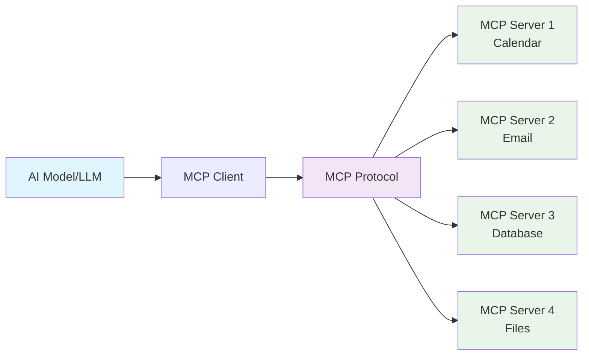
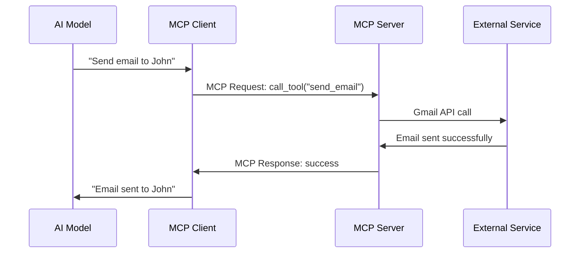

# MCP Protocol - Complete Beginner's Guide 🚀

## 🤔 What is MCP Protocol?

**MCP = Model Context Protocol**

Think of MCP as a **"universal translator"** that helps AI models (like ChatGPT, Claude) talk to different tools and services in a standardized way.

### 🏠 Real-World Analogy
Imagine you have a smart assistant (AI) that you want to:
- Check your calendar
- Send emails  
- Control smart home devices
- Access your files
- Query databases

**Without MCP**: You'd need different "languages" for each service
**With MCP**: One standard "language" for everything

## 🎯 Why MCP Matters?

### Before MCP (The Problem):
```
AI Model ❌ Calendar App (different API)
AI Model ❌ Email Service (different format)  
AI Model ❌ Database (different protocol)
AI Model ❌ File System (different method)
```

### After MCP (The Solution):
```
AI Model ✅ MCP Protocol ✅ All Services
```

## 🏗️ MCP Architecture (Simple View)



## 🔧 Key Components Explained

### 1. **MCP Client** 
- Lives inside the AI application
- Sends requests using MCP protocol
- **Example**: ChatGPT app with MCP support

### 2. **MCP Server**
- Wraps existing services/tools
- Responds in MCP format
- **Example**: Gmail MCP server, Calendar MCP server

### 3. **MCP Protocol**
- The standard "language" they use
- Based on JSON-RPC
- Defines how to ask for things and get responses

## 📋 What Can MCP Do? (Capabilities)

### 🛠️ **Tools**
AI can call functions/tools through MCP
```json
{
  "tool": "send_email",
  "parameters": {
    "to": "john@example.com",
    "subject": "Meeting reminder",
    "body": "Don't forget our 3PM meeting"
  }
}
```

### 📚 **Resources** 
AI can access data/content
```json
{
  "resource": "file://documents/report.pdf",
  "action": "read"
}
```

### 💾 **Prompts**
Pre-defined prompt templates
```json
{
  "prompt": "summarize_document",
  "variables": {
    "document": "quarterly_report.pdf"
  }
}
```

## 🌟 Real-World Examples

### Example 1: Personal Assistant
```
You: "Schedule a meeting with John tomorrow at 3PM and send him an email"

AI via MCP:
1. Calls calendar MCP server → creates meeting
2. Calls email MCP server → sends invitation
3. Reports back: "Done! Meeting scheduled and email sent"
```

### Example 2: Data Analysis
```
You: "Analyze last month's sales data and create a summary report"

AI via MCP:
1. Calls database MCP server → gets sales data
2. Calls analytics MCP server → processes data  
3. Calls document MCP server → creates report
4. Returns: "Report created and saved to your documents"
```

## 💻 Simple MCP Example Code

### Basic MCP Server (Python)
```python
from mcp import Server, Tool, Resource

# Create MCP server
server = Server("my-calculator")

# Define a tool
@server.tool("add_numbers")
def add_numbers(a: int, b: int) -> int:
    """Add two numbers together"""
    return a + b

@server.tool("get_weather")  
def get_weather(city: str) -> str:
    """Get weather for a city"""
    # In real app, call weather API
    return f"Sunny, 75°F in {city}"

# Define a resource
@server.resource("file://config.json")
def get_config():
    """Get application configuration"""
    return {"theme": "dark", "language": "en"}

# Start server
if __name__ == "__main__":
    server.run()
```

### Basic MCP Client Usage
```python
from mcp import Client

# Connect to MCP server
client = Client("http://localhost:8000")

# Use a tool
result = client.call_tool("add_numbers", {"a": 5, "b": 3})
print(f"5 + 3 = {result}")  # Output: 5 + 3 = 8

# Get weather
weather = client.call_tool("get_weather", {"city": "New York"})
print(weather)  # Output: Sunny, 75°F in New York

# Access a resource  
config = client.get_resource("file://config.json")
print(config)  # Output: {"theme": "dark", "language": "en"}
```

## 🔄 MCP Communication Flow



## 🎯 Benefits of MCP

### For Developers:
- ✅ **Standardized**: One protocol for everything
- ✅ **Reusable**: Write once, use with any MCP-compatible AI
- ✅ **Maintainable**: Easy to update and extend
- ✅ **Secure**: Built-in security features

### For Users:
- ✅ **Seamless**: AI can do more things automatically
- ✅ **Consistent**: Same experience across different tools
- ✅ **Powerful**: AI becomes truly helpful assistant
- ✅ **Safe**: Controlled access to your data/services

## 🛡️ Security in MCP

### Authentication
```json
{
  "auth": {
    "type": "bearer_token",
    "token": "your_secure_token"
  }
}
```

### Permissions
```json
{
  "permissions": {
    "tools": ["send_email", "read_calendar"],
    "resources": ["file://documents/*"],
    "scope": "read_write"
  }
}
```

## 🚀 Getting Started with MCP

### Step 1: Install MCP SDK
```bash
pip install mcp-sdk
```

### Step 2: Create Your First MCP Server
```python
# my_first_server.py
from mcp import Server

server = Server("hello-world")

@server.tool("greet")
def greet(name: str) -> str:
    return f"Hello, {name}!"

server.run()
```

### Step 3: Test It
```python
# test_client.py
from mcp import Client

client = Client("http://localhost:8000")
response = client.call_tool("greet", {"name": "Alice"})
print(response)  # Output: Hello, Alice!
```

## 🌍 MCP Ecosystem

### Popular MCP Servers:
- **📧 Email**: Gmail, Outlook integration
- **📅 Calendar**: Google Calendar, Outlook Calendar  
- **💾 Database**: PostgreSQL, MongoDB, MySQL
- **📁 Files**: Local files, Google Drive, Dropbox
- **🌐 Web**: Web scraping, API calls
- **🔧 DevOps**: Docker, Kubernetes, AWS

### MCP-Compatible AI Models:
- **Claude** (Anthropic) - Native support
- **ChatGPT** - Via plugins
- **Local LLMs** - Via integration libraries

## 📈 Future of MCP

### What's Coming:
- 🔄 **Streaming**: Real-time data updates
- 🧠 **Smart Routing**: AI chooses best tools automatically  
- 🔐 **Advanced Security**: Fine-grained permissions
- 🌐 **Federation**: Connect multiple MCP networks
- 📱 **Mobile**: MCP on smartphones and tablets

## 🎓 Key Takeaways

1. **MCP = Universal Language** for AI to talk to tools
2. **Standardization** makes everything work together
3. **Security** is built-in, not an afterthought
4. **Extensible** - easy to add new capabilities
5. **Future-proof** - designed for the AI-first world

## 🔗 Learn More

### Official Resources:
- 📖 [MCP Specification](https://spec.modelcontextprotocol.io/)
- 💻 [GitHub Repository](https://github.com/modelcontextprotocol)
- 📚 [Documentation](https://modelcontextprotocol.io/docs)
- 🎥 [Video Tutorials](https://youtube.com/mcp-protocol)

### Community:
- 💬 [Discord Server](https://discord.gg/mcp)
- 🐦 [Twitter Updates](https://twitter.com/mcp_protocol)
- 📝 [Blog Posts](https://blog.modelcontextprotocol.io)

---

**Think of MCP as the "USB standard" for AI** - just like USB lets you connect any device to any computer, MCP lets any AI connect to any service! 🔌✨
