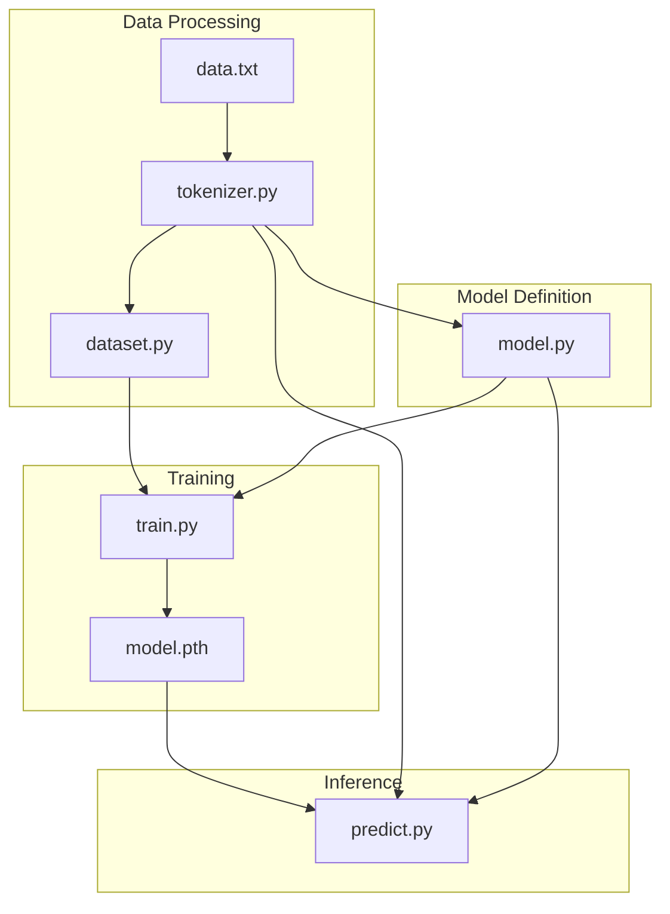

# Mini LLM Code Analysis & Architecture

## 🏗️ **Architecture Overview**

This is a simple **next-word prediction language model** that learns to generate text based on training data. Here's the complete flow:

```
📄 data.txt → 🔤 tokenizer.py → 📊 dataset.py → 🧠 model.py → 🏋️ train.py → 🔮 predict.py
```

---

## 📋 **Detailed File Analysis**

### 1. **data.txt** - Training Corpus
```
Purpose: Raw text data for training
Content: 10 simple sentences about Python, AI, ML
Size: Very small dataset (intentionally minimal for demo)
```

### 2. **tokenizer.py** - Text Preprocessing Pipeline
```python
# Core Functions:
📖 Read text file
🔤 Convert to lowercase  
✂️  Split into tokens (words)
📚 Build vocabulary mapping (word ↔ ID)
🔢 Encode text to numbers
🔤 Decode numbers back to text
```

**Key Outputs:**
- `vocab`: `{"python": 0, "is": 1, "easy": 2, ...}`
- `reverse_vocab`: `{0: "python", 1: "is", 2: "easy", ...}`
- `encoded_tokens`: `[15, 10, 6, 15, 10, 14, ...]`

### 3. **dataset.py** - Training Data Preparation
```python
# Creates input-output pairs for next-word prediction
# Example:
# Input: [15]           → Output: 10  ("python" → "is")
# Input: [15, 10]       → Output: 6   ("python is" → "easy")
# Input: [15, 10, 6]    → Output: 15  ("python is easy" → "python")
```

### 4. **model.py** - Neural Network Architecture
```python
class MiniLLM(nn.Module):
    def __init__(self, vocab_size, embedding_dim):
        # Architecture layers defined here
    
    def forward(self, x):
        # Forward pass logic
```

**Architecture Flow:**
```
Input Token IDs
       ↓
🔤 Embedding Layer (converts IDs to vectors)
       ↓
📊 Mean Pooling (average all word vectors)
       ↓
🧠 Linear Layer 1 (embedding_dim → 64)
       ↓
⚡ ReLU Activation
       ↓
🎯 Linear Layer 2 (64 → vocab_size)
       ↓
📈 Output Logits (probability scores for each word)
```

### 5. **train.py** - Model Training
```python
# Training Pipeline:
1️⃣ Load dataset (inputs, outputs)
2️⃣ Initialize model
3️⃣ Define loss function (CrossEntropyLoss)
4️⃣ Define optimizer (Adam)
5️⃣ Training loop (200 epochs)
6️⃣ Save trained model
```

### 6. **predict.py** - Text Generation
```python
# Generation Pipeline:
1️⃣ Load trained model
2️⃣ Get user input
3️⃣ Encode input to token IDs
4️⃣ Predict next word (20 times)
5️⃣ Decode IDs back to words
6️⃣ Display generated text
```

---

## 🎯 **Architecture Diagram**



---

## 🔄 **Complete Workflow**

### **Phase 1: Data Preparation**
```
Raw Text → Tokenization → Vocabulary → Encoding → Training Pairs
```

### **Phase 2: Model Training**
```
Training Data → Neural Network → Loss Calculation → Backpropagation → Model Weights
```

### **Phase 3: Text Generation**
```
User Input → Encoding → Model Prediction → Decoding → Generated Text
```

---

## 🧠 **Model Architecture Details**

| Layer | Input Shape | Output Shape | Purpose |
|-------|-------------|--------------|---------|
| Embedding | `[batch_size, seq_len]` | `[batch_size, seq_len, 16]` | Convert token IDs to vectors |
| Mean Pooling | `[batch_size, seq_len, 16]` | `[batch_size, 16]` | Average word embeddings |
| Linear 1 | `[batch_size, 16]` | `[batch_size, 64]` | Hidden representation |
| ReLU | `[batch_size, 64]` | `[batch_size, 64]` | Non-linear activation |
| Linear 2 | `[batch_size, 64]` | `[batch_size, vocab_size]` | Output probabilities |

---

## ⚙️ **Key Parameters**

```python
VOCAB_SIZE = 22        # Number of unique words
EMBEDDING_DIM = 16     # Word vector dimension
HIDDEN_SIZE = 64       # Hidden layer size
EPOCHS = 200           # Training iterations
LEARNING_RATE = 0.01   # Optimization step size
MAX_WORDS = 20         # Generation length
```

---

## 🎯 **Purpose of Each Class/Function**

| Component | Purpose |
|-----------|---------|
| `MiniLLM` | Neural network model for next-word prediction |
| `vocab` | Maps words to unique integer IDs |
| `reverse_vocab` | Maps integer IDs back to words |
| `inputs/outputs` | Training data pairs for supervised learning |
| `criterion` | Measures prediction error (CrossEntropyLoss) |
| `optimizer` | Updates model weights (Adam) |

This is a **minimal but complete** implementation of a language model that demonstrates the core concepts of modern LLMs in a simplified form! 🚀
