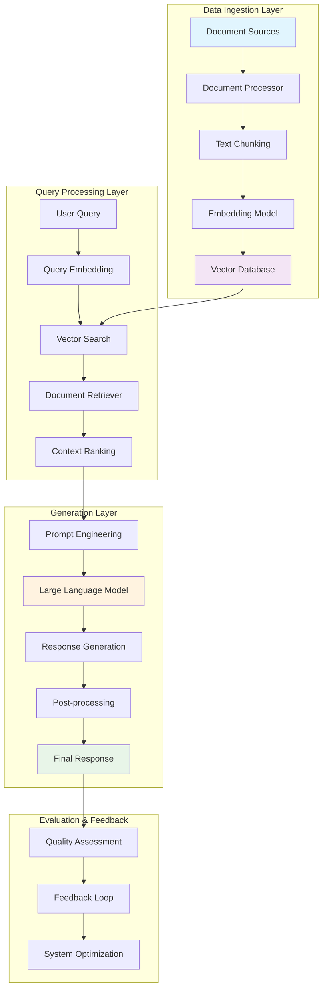

# RAG (Retrieval-Augmented Generation) Interview Questions & Architecture

## 🏗️ RAG System Architecture Diagram



## 📋 RAG Interview Questions

### **Beginner Level Questions**

#### 1. **What is RAG and why is it important?**
**Expected Answer:**
- RAG combines retrieval and generation to provide factual, up-to-date responses
- Solves LLM limitations: hallucination, knowledge cutoff, domain-specific information
- Enables grounding responses in external knowledge sources
- Cost-effective alternative to fine-tuning for domain adaptation

#### 2. **Explain the main components of a RAG system.**
**Expected Answer:**
- **Document Processing**: Chunking, cleaning, preprocessing
- **Embedding Model**: Converts text to vector representations
- **Vector Database**: Stores and indexes document embeddings
- **Retriever**: Finds relevant documents based on query similarity
- **Generator**: LLM that creates responses using retrieved context
- **Orchestrator**: Coordinates the entire pipeline

#### 3. **What are the advantages of RAG over fine-tuning?**
**Expected Answer:**
- **Dynamic Knowledge**: Can update knowledge without retraining
- **Cost-Effective**: No need for expensive model training
- **Transparency**: Can trace responses back to source documents
- **Scalability**: Easy to add new documents
- **Accuracy**: Reduces hallucination by grounding in facts

### **Intermediate Level Questions**

#### 4. **How do you handle document chunking in RAG systems?**
**Expected Answer:**
```python
# Different chunking strategies
strategies = {
    "fixed_size": "Split by character/token count",
    "semantic": "Split by meaning/topics", 
    "recursive": "Try multiple delimiters hierarchically",
    "sliding_window": "Overlapping chunks for context preservation"
}

# Key considerations
considerations = [
    "Chunk size vs context window",
    "Overlap between chunks", 
    "Preserving semantic meaning",
    "Document structure awareness"
]
```

#### 5. **What are different retrieval strategies in RAG?**
**Expected Answer:**
- **Dense Retrieval**: Semantic similarity using embeddings
- **Sparse Retrieval**: Keyword-based (BM25, TF-IDF)
- **Hybrid Retrieval**: Combines dense + sparse methods
- **Re-ranking**: Two-stage retrieval with cross-encoders
- **Multi-vector**: Different embeddings for different aspects

#### 6. **How do you evaluate RAG system performance?**
**Expected Answer:**
```python
evaluation_metrics = {
    "retrieval_metrics": [
        "Precision@K", "Recall@K", "MRR", "NDCG"
    ],
    "generation_metrics": [
        "BLEU", "ROUGE", "BERTScore", "Faithfulness"
    ],
    "end_to_end_metrics": [
        "Answer Relevancy", "Context Precision", 
        "Answer Correctness", "Groundedness"
    ]
}
```

### **Advanced Level Questions**

#### 7. **How would you optimize RAG for production at scale?**
**Expected Answer:**
```python
optimization_strategies = {
    "retrieval_optimization": [
        "Vector index optimization (HNSW, IVF)",
        "Caching frequent queries",
        "Approximate nearest neighbor search",
        "Parallel retrieval processing"
    ],
    "generation_optimization": [
        "Model quantization",
        "Batch processing",
        "Streaming responses",
        "GPU optimization"
    ],
    "system_optimization": [
        "Load balancing",
        "Horizontal scaling",
        "Database sharding",
        "CDN for static content"
    ]
}
```

#### 8. **What are the challenges in RAG and how do you address them?**
**Expected Answer:**
- **Context Length Limitations**: Use summarization, hierarchical retrieval
- **Retrieval Quality**: Improve embeddings, use re-ranking
- **Hallucination**: Implement fact-checking, confidence scoring
- **Latency**: Optimize retrieval, use caching, async processing
- **Cost**: Model optimization, efficient indexing

#### 9. **How do you handle multi-modal RAG systems?**
**Expected Answer:**
```python
multimodal_rag = {
    "text_images": "CLIP embeddings for unified search",
    "tables": "Specialized table understanding models",
    "code": "Code-specific embeddings and retrieval",
    "audio": "Speech-to-text + text RAG pipeline",
    "video": "Frame extraction + multimodal embeddings"
}
```

#### 10. **Explain advanced RAG architectures.**
**Expected Answer:**
- **Hierarchical RAG**: Multi-level retrieval (document → chunk → sentence)
- **Graph RAG**: Knowledge graph integration
- **Agentic RAG**: LLM agents for complex reasoning
- **Self-RAG**: Self-reflection and critique mechanisms
- **Adaptive RAG**: Dynamic strategy selection based on query type

### **System Design Questions**

#### 11. **Design a RAG system for a customer support chatbot handling 10M+ documents.**

**Expected Architecture:**
```python
system_design = {
    "data_layer": {
        "document_store": "Distributed file system (S3, HDFS)",
        "vector_db": "Pinecone/Weaviate with sharding",
        "metadata_db": "PostgreSQL with indexing",
        "cache": "Redis for frequent queries"
    },
    "processing_layer": {
        "ingestion": "Apache Kafka + Spark for batch processing",
        "embedding": "Sentence-transformers with GPU clusters",
        "indexing": "Distributed vector indexing"
    },
    "serving_layer": {
        "api_gateway": "Load balancer + rate limiting",
        "retrieval_service": "Microservice with horizontal scaling",
        "generation_service": "LLM serving with model parallelism",
        "orchestrator": "Workflow management"
    },
    "monitoring": {
        "metrics": "Prometheus + Grafana",
        "logging": "ELK stack",
        "tracing": "Jaeger for request tracing"
    }
}
```

#### 12. **How would you implement real-time document updates in RAG?**
**Expected Answer:**
```python
real_time_updates = {
    "incremental_indexing": "Add new documents without full reindex",
    "change_detection": "Monitor file systems/databases for changes",
    "versioning": "Track document versions and update history",
    "consistency": "Eventual consistency with conflict resolution",
    "hot_swapping": "Update indices without downtime"
}
```

### **Technical Deep-Dive Questions**

#### 13. **Explain embedding models and their trade-offs in RAG.**
**Expected Answer:**
```python
embedding_models = {
    "sentence_transformers": {
        "pros": "Good general performance, easy to use",
        "cons": "May not capture domain-specific nuances",
        "use_case": "General purpose RAG"
    },
    "openai_embeddings": {
        "pros": "High quality, regularly updated",
        "cons": "API dependency, cost",
        "use_case": "Production systems with budget"
    },
    "domain_specific": {
        "pros": "Optimized for specific domains",
        "cons": "Requires training/fine-tuning",
        "use_case": "Specialized applications"
    }
}
```

#### 14. **How do you handle conflicting information in retrieved documents?**
**Expected Answer:**
- **Source Ranking**: Prioritize authoritative sources
- **Temporal Ordering**: Prefer recent information
- **Confidence Scoring**: Use retrieval scores and model confidence
- **Explicit Handling**: Acknowledge conflicts in responses
- **Human-in-the-loop**: Flag conflicts for human review

#### 15. **Implement a simple RAG retrieval function.**
**Expected Code:**
```python
def retrieve_and_generate(query: str, top_k: int = 5):
    # 1. Embed the query
    query_embedding = embedding_model.encode(query)
    
    # 2. Retrieve similar documents
    results = vector_db.similarity_search(
        query_embedding, 
        top_k=top_k,
        threshold=0.7
    )
    
    # 3. Re-rank results (optional)
    reranked_results = reranker.rerank(query, results)
    
    # 4. Prepare context
    context = "\n".join([doc.content for doc in reranked_results])
    
    # 5. Generate response
    prompt = f"""
    Context: {context}
    Question: {query}
    Answer based on the context:
    """
    
    response = llm.generate(prompt)
    
    return {
        "answer": response,
        "sources": [doc.metadata for doc in reranked_results],
        "confidence": calculate_confidence(query, response, context)
    }
```

### **Scenario-Based Questions**

#### 16. **Your RAG system is returning irrelevant results. How do you debug and fix it?**
**Debugging Steps:**
1. **Check Retrieval Quality**: Analyze similarity scores, examine retrieved documents
2. **Embedding Analysis**: Verify query and document embeddings make sense
3. **Chunk Quality**: Review chunking strategy and chunk boundaries
4. **Index Health**: Check vector database performance and index quality
5. **Query Processing**: Ensure query preprocessing is working correctly

**Solutions:**
- Improve chunking strategy
- Fine-tune embedding model
- Implement re-ranking
- Add query expansion
- Use hybrid retrieval

#### 17. **How would you implement RAG for a multilingual support system?**
**Expected Answer:**
```python
multilingual_rag = {
    "approach_1_unified": {
        "embedding": "Multilingual models (mBERT, XLM-R)",
        "pros": "Single index, cross-lingual retrieval",
        "cons": "Potential quality degradation"
    },
    "approach_2_separate": {
        "embedding": "Language-specific models",
        "pros": "Better quality per language",
        "cons": "Multiple indices, complexity"
    },
    "implementation": [
        "Language detection",
        "Language-specific processing",
        "Translation for cross-lingual queries",
        "Localized response generation"
    ]
}
```

## 🎯 Key Areas to Focus On

### **For Junior Roles:**
- Basic RAG concepts and components
- Simple implementation using existing libraries
- Understanding of embeddings and vector similarity
- Basic evaluation metrics

### **For Senior Roles:**
- System design and scalability
- Advanced retrieval strategies
- Production optimization
- Multi-modal and complex RAG architectures
- Performance tuning and debugging

### **For Architect Roles:**
- End-to-end system design
- Technology selection and trade-offs
- Integration with existing systems
- Cost optimization and ROI analysis
- Team structure and development processes

## 📚 Recommended Preparation

1. **Hands-on Experience**: Build a simple RAG system
2. **Paper Reading**: Key RAG research papers
3. **Tool Familiarity**: LangChain, LlamaIndex, vector databases
4. **Production Considerations**: Scaling, monitoring, deployment
5. **Latest Trends**: Advanced RAG techniques and improvements

This comprehensive guide covers the essential aspects of RAG systems that are commonly discussed in technical interviews, from basic concepts to advanced implementation details.
